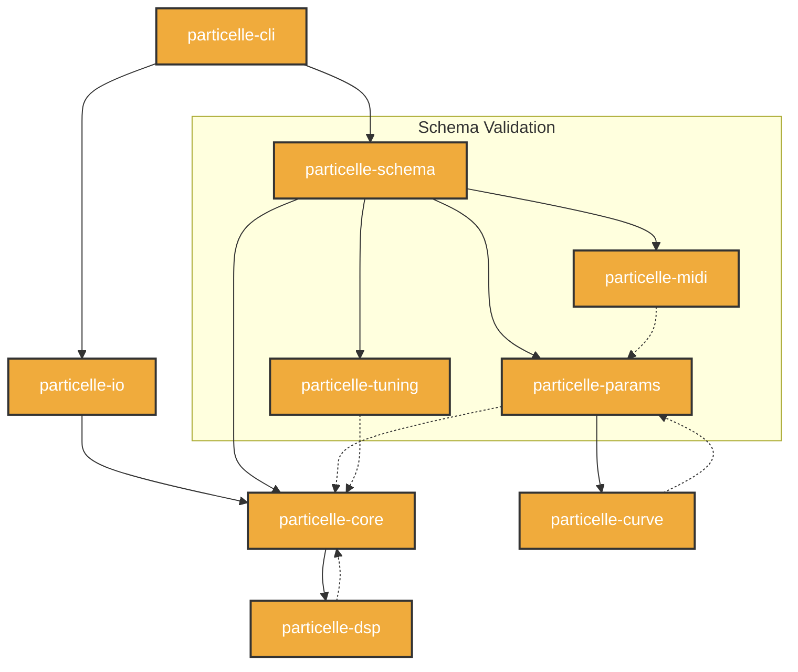
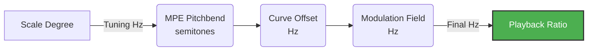
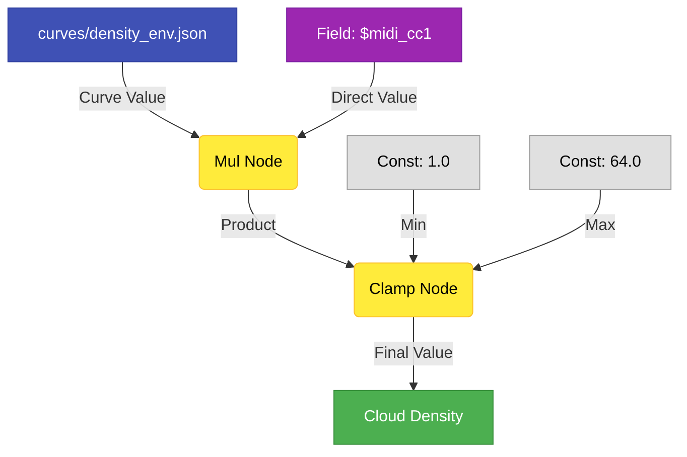

<p align="center">
  
</p>

# Particelle

Sound, atomized.

**A research-grade granular synthesis engine for immersive and microtonal composition.**

Particelle is a 64-bit, production-grade, surround-native, microtonal-first granular synthesis engine written entirely in Rust. It is not a plugin. It is not GUI-driven. It operates as infrastructure-level audio software, fully controlled through YAML configuration files and a command-line interface. Every parameter is a signal. Every result is reproducible.

---

## Installation

### One-Liner

```sh
git clone https://github.com/TheColby/Particelle.git && cd Particelle && ./install.sh
```

### From Source (manual)

```sh
# Clone the repository
git clone https://github.com/TheColby/Particelle.git
cd Particelle

# Build the release binary
cargo build --release

# The binary is at target/release/particelle
# Optionally, copy it somewhere on your PATH:
cp target/release/particelle /usr/local/bin/
```

### Requirements

- **Rust 1.70+** (install via [rustup.rs](https://rustup.rs/)). On mac, you can install [Homebrew](https://brew.sh) and do `brew install rust`.
- A C compiler for native audio dependencies (Xcode CLT on macOS, `build-essential` on Linux)

### Verify Installation

```sh
particelle --version
# → particelle 0.1.0
```

---

## Help

Every subcommand has built-in help:

```sh
particelle --help
```

```
Usage: particelle <COMMAND>

Commands:
  render    Render a patch to an audio file (offline, deterministic)
  run       Run a patch in realtime on a hardware device
  validate  Check a YAML patch for schema errors
  init      Generate a default starter patch to stdout
  curve     Preview a JSON curve file

Options:
  -h, --help     Print help
  -V, --version  Print version
```

Individual subcommands:

```sh
particelle render --help
particelle run --help
particelle curve --help
```

---

## 60-Second Quick Start

### 1. Generate a starter patch

```sh
particelle init > my_first_patch.yaml
```

This writes a complete, valid YAML patch with sensible defaults (stereo, 48kHz, Hann window, single cloud).

### 2. Validate it

```sh
particelle validate my_first_patch.yaml
# → ✓ Patch is valid. 1 cloud, 2 channels, 12-TET tuning.
```

### 3. Render to file

```sh
particelle render my_first_patch.yaml -o output.wav --duration 10.0
# → Rendering 10.0s @ 48000Hz … done. Wrote output.wav (960000 frames, 2 channels)
```

### 4. Play in realtime

```sh
particelle run my_first_patch.yaml
# → Streaming to "Default Output" @ 48000Hz, 256 block … (Ctrl+C to stop)
```

---

## Example Patches

### Example 1 — Stereo Shimmer

```yaml
engine:
  sample_rate: 48000
  block_size: 256

layout:
  channels:
    - { name: "L", azimuth_deg: -30.0, elevation_deg: 0.0 }
    - { name: "R", azimuth_deg:  30.0, elevation_deg: 0.0 }

clouds:
  - id: shimmer
    source: audio/music_example.wav
    density: 20.0
    duration: 0.12
    amplitude: 0.6
    position: 0.5
    window: { type: hann }
    listener_pos: { x: 0.0, y: 1.0, z: 0.0 }
    width: 0.3
```

```sh
particelle render shimmer.yaml -o shimmer.wav --duration 8.0
```

### Example 2 — 4× Timestretch

Slow down a 4-second file to 16 seconds without changing pitch. The grain read position is driven by a linear curve that advances 4× slower than realtime:

```yaml
clouds:
  - id: stretch
    source: audio/music_example.wav
    density: 24.0
    duration: 0.08
    amplitude: 0.5
    window: { type: hann }
    listener_pos: { x: 0.0, y: 1.0, z: 0.0 }
    width: 0.8
    position:
      op: curve
      ref: "curves/stretch_pos.json"
```

The curve `curves/stretch_pos.json` maps 16s of clock time to 4s of file position:

```json
{
  "segments": [
    { "x": 0.0, "y": 0.0, "x_end": 16.0, "y_end": 4.0, "shape": "linear" }
  ],
  "extrapolation": { "left": "clamp", "right": "clamp" }
}
```

```sh
particelle render audio/stretch_4x.yaml -o stretched.wav --duration 16.0
```

### Example 3 — 31-EDO Microtonal Drone

A dense grain cloud tuned to 31 equal divisions of the octave:

```yaml
engine:
  sample_rate: 96000
  block_size: 512

tuning:
  mode: edo
  steps: 31

layout:
  channels:
    - { name: "L", azimuth_deg: -30.0 }
    - { name: "R", azimuth_deg:  30.0 }

clouds:
  - id: drone
    source: samples/cello_sustain.flac
    density: 8.0
    duration: 0.5
    amplitude: 0.4
    position: 0.0
    window: { type: kaiser, beta: 8.6 }
    listener_pos: { x: 0.0, y: 1.5, z: 0.0 }
    width: 0.6
```

```sh
particelle render drone_31edo.yaml -o drone.wav --duration 30.0
```

### Example 4 — 7.1.4 Immersive Spatialization

12-channel Atmos-compatible layout with grains drifting through 3D space:

```yaml
engine:
  sample_rate: 96000
  block_size: 256

layout:
  channels:
    - { name: "FL",  azimuth_deg: -30.0,  elevation_deg:  0.0 }
    - { name: "FR",  azimuth_deg:  30.0,  elevation_deg:  0.0 }
    - { name: "C",   azimuth_deg:   0.0,  elevation_deg:  0.0 }
    - { name: "LFE", azimuth_deg:   0.0,  elevation_deg:  0.0 }
    - { name: "BL",  azimuth_deg: -150.0, elevation_deg:  0.0 }
    - { name: "BR",  azimuth_deg:  150.0, elevation_deg:  0.0 }
    - { name: "SL",  azimuth_deg: -90.0,  elevation_deg:  0.0 }
    - { name: "SR",  azimuth_deg:  90.0,  elevation_deg:  0.0 }
    - { name: "TFL", azimuth_deg: -45.0,  elevation_deg: 45.0 }
    - { name: "TFR", azimuth_deg:  45.0,  elevation_deg: 45.0 }
    - { name: "TBL", azimuth_deg: -135.0, elevation_deg: 45.0 }
    - { name: "TBR", azimuth_deg:  135.0, elevation_deg: 45.0 }

clouds:
  - id: orbit
    source: samples/glass_textures.wav
    density: 16.0
    duration: 0.2
    amplitude: 0.5
    window: { type: tukey, alpha: 0.3 }
    listener_pos: { x: 0.0, y: 0.0, z: 0.0 }
    width: 0.5
    position:
      op: curve
      ref: "curves/spatial_orbit.json"
```

```sh
particelle render immersive.yaml -o atmos_orbit.wav --duration 60.0
```

## Hold Up! What Is Granular Synthesis?

Granular synthesis is a method of sound generation that operates on a fundamentally different principle than traditional synthesis or sampling. Instead of playing back audio as a continuous stream, granular synthesis **breaks sound into hundreds or thousands or more of tiny fragments** — called *grains* — and reassembles them in new configurations.

### The Grain

A grain is a short snippet of audio, typically between **1 and 200 milliseconds** long. Each grain is extracted from a source recording (or generated from an oscillator), shaped by a windowing function (like a Hann or Gaussian curve) that fades it smoothly in and out, and then placed at a specific position in time and space.

A single grain sounds like almost nothing — a brief click or a wisp of tone. But when hundreds of grains are layered together per second, something remarkable happens: a continuous, evolving texture emerges from the aggregate. This is the central insight of granular synthesis.


### How It Works: The Cloud

A *cloud* is a stream of grains emitted over time. A cloud has parameters that control:

| Parameter | What it does |
|-----------|-------------|
| **Density** | How many grains per second are emitted (1–1000+) |
| **Duration** | How long each grain lasts (1ms–500ms) |
| **Position** | Where in the source audio each grain reads from |
| **Amplitude** | How loud each grain is |
| **Pitch/Rate** | The playback speed of each grain (affects pitch) |
| **Window** | The fade-in/fade-out envelope shape applied to each grain |
| **Spatial position** | Where the grain is placed in 3D space (for surround) |

#### The Hop Size and Overlap Factor

The **hop size** is the time interval between successive grain onsets — essentially, how far the window "slides" between one grain and the next. It is the single most important parameter governing the character of a grain cloud.

The **overlap factor** is the ratio of grain duration to hop size. At 50% overlap (hop = half the grain length), adjacent grains cross-fade smoothly through each other, producing a continuous, artifact-free texture — this is the regime shown in the plot above. The relationship:

> **overlap factor = grain_duration / hop_size**

| Overlap Factor | Hop Size (for 50ms grain) | Sonic Character |
|:-:|:-:|---|
| **0.1×** | 500ms | Sparse, isolated events — pointillist, stochastic |
| **0.25×** | 200ms | Scattered droplets — grains separated by silence |
| **0.5×** | 100ms | Rhythmic pulse — grains with gaps, percussive feel |
| **1×** (no overlap) | 50ms | Back-to-back grains, choppy, percussive |
| **2×** (50% overlap) | 25ms | Smooth, continuous texture, minimal artifacts |
| **4×** (75% overlap) | 12.5ms | Dense, lush, blurred — spectral smearing |
| **8×** (87.5% overlap) | 6.25ms | Extremely dense, chorus-like, washy |
| **16×+** | <3ms | Approaching resynthesis; timbre transforms |

**Sub-unity overlap (<1×)** produces silence between grains. The lower the factor, the sparser the texture. At very low values (0.1×–0.25×), each grain is an isolated sonic event — you hear individual “droplets” or “particles” with audible gaps between them. This regime is ideal for pointillist composition, stochastic textures, and rhythmic granulation where the silence *between* grains is as important as the grains themselves.

**Low overlap (1×–2×)** preserves transients and rhythmic detail. Each grain is distinct; the source material’s attack characteristics survive. Useful for percussive textures, rhythmic granulation, and time-domain effects.

**High overlap (4×–16×)** blurs the source into a cloud where individual grains are no longer perceptible. The output becomes a spectral average of the source region. This is the classic “granular pad” sound — shimmering, suspended, and evolving. At very high overlap, the effect resembles spectral freezing.

In Particelle, hop size is derived from the **density** parameter (grains per second) and the grain **duration**. Both are full signals, meaning the overlap factor can evolve continuously over time under curve or MIDI control.

When density is high and duration is long enough for grains to overlap, the output sounds like a sustained, shimmering texture. When density is low, individual grains become audible as discrete sonic events — like raindrops on glass.

### Why Is It Powerful?

Granular synthesis decouples properties that are normally locked together in recorded audio:

**Time and pitch become independent.** In normal playback, slowing down audio lowers its pitch. In granular synthesis, you can move through the source file at any speed (timestretching) while each grain plays back at the original pitch — or any other pitch you choose. A 4-second recording can become a 40-minute ambient piece without any change in timbre.

**Position becomes a parameter.** Instead of playing a file from start to finish, the read position can jump, freeze, reverse, scatter, or drift under curve or signal control. You can "freeze" on a single moment of a recording indefinitely, or scan through it in non-linear patterns.

**Space becomes a compositional dimension.** Each grain can be placed independently in a 3D listener space. A single source file can be scattered across a 12-channel speaker array, with each grain arriving from a different direction. Sound becomes sculptural.

### A Simple Analogy

Think of a photograph. Granular synthesis is like cutting the photograph into thousands of tiny tiles, then reassembling them — but now you can:

- Rearrange the tiles in any order
- Repeat certain tiles thousands of times
- Change the color of each tile independently
- Spread them across the walls of a room
- Control how fast you scan across them

The source material is still recognizable, but you have total control over its micro-structure.

### The Role of the Window Function

Every grain is multiplied by a *window function* — a bell-shaped curve that smoothly fades the grain in and out. Without windowing, each grain would start and stop abruptly, producing harsh clicks at the boundaries.


Different window shapes produce different timbral qualities. A Hann window gives a soft, warm overlap. A Kaiser window with a high beta produces a tighter, more focused grain. Particelle includes **35+ window types** precisely because the window is one of the most expressive parameters in granular synthesis.

### Where Granular Synthesis Is Used

- **Ambient and electroacoustic music** — timestretching, texture generation, spectral freezing
- **Film and game audio** — creating evolving atmospheric soundscapes from short recordings
- **Sound design** — transforming mundane recordings into otherworldly textures
- **Scientific research** — auditory perception studies, acoustic ecology, spatial audio experiments
- **Live performance** — real-time granular processing of live instruments or voice
- **Installation art** — long-duration generative pieces running unattended for hours or days

### Granular Synthesis in Particelle

Particelle takes these ideas and builds them into a **production-grade, multichannel, microtonal, deterministic engine**. Every parameter listed above — density, duration, position, amplitude, pitch, window, spatial position — is a full signal in Particelle. That means each parameter can be a constant, a time-varying curve, a MIDI controller, an MPE expression, or an arithmetic combination of all of the above. There are no fixed parameters and no special cases.

---

## What Makes Particelle Different

### Surround-Native from the First Buffer

Particelle does not retrofit stereo to surround. The internal audio model is multichannel-native at the type level. Channels carry metadata — name, azimuth, elevation — and the engine operates over arbitrary discrete layouts including 2ch, 5.1, 7.1.4, and custom configurations up to any channel count. Grain positioning is computed in 3D listener space and distributed across channels via a `Spatializer` trait. There is no stereo assumption anywhere in the codebase.

### Microtonal-First

The tuning subsystem is not an add-on. It is a load-bearing part of the signal chain. Supported tuning models include arbitrary EDO systems, fixed Just Intonation via rational ratios, and Scala format (`.scl` and `.kbm`). The complete pitch pipeline — from scale degree through pitchbend, curve offsets, and modulation — operates in `f64` at every step. There is no rounding in the frequency domain.

MPE (MIDI Polyphonic Expression) integrates natively: per-note pitchbend, pressure, and timbre are first-class signals routed directly into the parameter graph.

### Full Parameter Signal Graph

In Particelle, parameters are not values. They are signals. `ParamSignal` is a composable expression graph: constants, curves, control inputs, sums, products, maps, and clamps all compose into a unified signal that resolves to `f64` at render time. There are no special-cased parameters. No parameter bypasses the graph.

YAML declares every parameter. JSON control-point curves express temporal behavior. Control-rate values are upsampled to audio rate through configurable reconstruction methods including ZOH, linear, cubic, monotone cubic, sinc interpolation, one-pole and two-pole filters, slew limiters, and MinBLEP step reconstruction.

### Deterministic Offline Rendering

Any patch that runs in realtime can run offline with byte-identical output given equal inputs. Randomness is seeded and deterministic. Offline renders are batchable and scriptable. Hash-based regression testing is a first-class part of the test suite.

### 35+ Window Types

The windowing system covers standard research windows (Hann, Hamming, Blackman-Harris, Kaiser, DPSS, Dolph-Chebyshev) and specialized variants (Planck taper, KBD, asymmetric Tukey, Rife-Vincent, user-defined cosine sum). All windows are generated in `f64`, cached by spec and length, and normalized by peak, RMS, or sum as specified. No window is computed more than once per session.

### Rust Architecture

Particelle is written entirely in Rust. The realtime audio callback performs zero heap allocation. Lock-free queues separate the audio thread from all I/O. Internal precision is `f64` throughout. The hardware boundary converts to `f32` only at the device interface, if required by the driver. Thread safety is guaranteed by the type system.

---

## Who Particelle Is For

Particelle is designed for:

- Microtonal composers working in EDO, JI, or Scala tuning systems
- Immersive audio composers and installation artists working in surround and spatial formats
- Spatial audio researchers building reproducible experimental workflows
- Algorithmic composition researchers who require deterministic, batchable rendering
- Developers building sound systems that require formal architectural boundaries

Particelle is not designed for:

- Casual preset-driven production
- GUI-centric workflows
- Users who need a DAW plugin

If you are looking for a visual instrument, Particelle is not the right tool. If you are building infrastructure for a complex compositional system, it may be exactly right.

---

## Core Concepts

| Concept | Description |
|---------|-------------|
| **Matter** | The source audio material a cloud reads grains from. May be a file on disk or a realtime input stream. |
| **Cloud** | A grain emitter. Owns an `EmitterParams` struct specifying density, duration, position, rate, amplitude, spread, and spatial position. Multiple clouds may run simultaneously over the same or different Matter sources. |
| **Particle** | A single active grain. Has a read position, playback rate, elapsed duration, window phase, 3D position, and pre-computed per-channel gains. Particles are pooled; no allocation occurs during grain scheduling. |
| **Field** | A named scalar value in the signal routing layer. Fields are populated by MIDI, MPE, or external control, and are readable by `ParamSignal::Control` nodes. |
| **ParamSignal** | A composable signal expression. Variants: `Const`, `Curve`, `Control`, `Sum`, `Mul`, `Map`, `Clamp`, `ScaleOffset`. All variants resolve to `f64`. Signal graphs are constructed from YAML and evaluated per-block at render time. |
| **Curve** | A JSON-defined control-point curve. Segments carry an explicit shape per interval. Curves are compiled before rendering. Evaluation inside the audio loop is a direct function call with no parsing and no allocation. |
| **Tuning** | An implementation of the `Tuning` trait. Converts scale degrees to frequencies in `f64`. The broader pitch pipeline applies MPE pitchbend, curve offsets, and modulation on top of the tuning frequency before computing playback ratio. |
| **Spatializer** | A trait defining how a grain's 3D position and width are distributed as per-channel gain values. The default implementation uses amplitude panning. The interface is open for VBAP, HRTF, and other methods. |

---

## Architecture Overview



All internal audio data is `f64`. Multichannel buffers are planar: one `Vec<f64>` per channel. The block size and sample rate are fixed at engine initialization. Frame time is tracked as a monotonic `u64`.

Curves are compiled from JSON into efficient evaluators before the first block is processed. Windows are computed once, cached by `(WindowSpec, length, normalization)`, and returned as shared `Arc<[f64]>` slices. No window is recomputed during rendering.

The engine runs identically in offline mode (writing to file) and realtime mode (driving a hardware device). The audio callback in realtime mode performs no heap allocation. A lock-free ring buffer separates the audio thread from all I/O operations.

---

## YAML-Centric Workflow

All engine behavior is declared in YAML. There are no hidden parameters. No behavior is configured through code paths that bypass the schema. The YAML file is the complete, reproducible description of a patch.

```yaml
engine:
  sample_rate: 96000
  block_size: 256

layout:
  channels:
    - { name: "L",   azimuth_deg: -30.0, elevation_deg: 0.0 }
    - { name: "R",   azimuth_deg:  30.0, elevation_deg: 0.0 }
    - { name: "C",   azimuth_deg:   0.0, elevation_deg: 0.0 }
    - { name: "LFE", azimuth_deg:   0.0, elevation_deg: 0.0 }
    - { name: "Ls",  azimuth_deg: -110.0, elevation_deg: 0.0 }
    - { name: "Rs",  azimuth_deg:  110.0, elevation_deg: 0.0 }

tuning:
  mode: edo
  steps: 31

clouds:
  - id: shimmer
    source: samples/sustained_string.flac
    density: { op: mul, args: [16.0, "$density_mod"] }
    duration: 0.18
    amplitude: 0.6
    window:
      type: hann
    listener_pos: { x: 0.0, y: 1.5, z: 0.0 }
    width: 0.4
```

Curves are defined in separate JSON files and referenced by name:

```json
{
  "segments": [
    { "x": 0.0, "y": 0.0, "x_end": 4.0, "y_end": 1.0, "shape": "smootherstep" },
    { "x": 4.0, "y": 1.0, "x_end": 8.0, "y_end": 0.2, "shape": { "exp": { "k": 3.0 } } }
  ],
  "extrapolation": { "left": "clamp", "right": "clamp" }
}
```

CLI usage:

```sh
# Validate a patch
particelle validate patch.yaml

# Render to file
particelle render patch.yaml -o output.wav --duration 120.0

# Run in realtime
particelle run patch.yaml

# Generate a default patch
particelle init > patch.yaml

# Preview a curve
particelle curve curves/density.json --resolution 1000
```

---

## Microtonal Workflow

Particelle treats tuning as a structural element, not a parameter. The scale is declared in YAML and applies globally to all clouds that reference degrees rather than raw frequencies.

**31-EDO drone:**

```yaml
tuning:
  mode: edo
  steps: 31
```

**Just Intonation:**

```yaml
tuning:
  mode: ji
  ratios:
    - { degree: 0, num: 1,  den: 1  }
    - { degree: 1, num: 9,  den: 8  }
    - { degree: 2, num: 5,  den: 4  }
    - { degree: 3, num: 4,  den: 3  }
    - { degree: 4, num: 3,  den: 2  }
    - { degree: 5, num: 5,  den: 3  }
    - { degree: 6, num: 15, den: 8  }
```

**Scala format:**

```yaml
tuning:
  mode: scala
  scl_path: scales/partch_43.scl
  kbm_path: scales/partch_43.kbm
```

The full pitch pipeline for a grain: 



All arithmetic is `f64`. No conversion to `f32` occurs before the hardware boundary.

MPE pitchbend range is configurable per voice. Per-note pressure and timbre are routed into the ParamSignal graph as named Fields.

---

## Surround and Spatial Workflow

Layouts are declared declaratively. Any number of channels with any position may be specified. The engine supports both Spherical (Azimuth/Elevation) and Cartesian (X/Y/Z) coordinates.

**Spherical / Dolby Atmos style (degrees):**
```yaml
layout:
  channels:
    - { name: "FL",  azimuth_deg: -30.0,  elevation_deg:  0.0 }
    - { name: "FR",  azimuth_deg:  30.0,  elevation_deg:  0.0 }
    - { name: "C",   azimuth_deg:   0.0,  elevation_deg:  0.0 }
    - { name: "LFE", azimuth_deg:   0.0,  elevation_deg:  0.0 }
    - { name: "BL",  azimuth_deg: -150.0, elevation_deg:  0.0 }
    - { name: "BR",  azimuth_deg:  150.0, elevation_deg:  0.0 }
    - { name: "TFL", azimuth_deg:  -45.0, elevation_deg: 45.0 }
    - { name: "TFR", azimuth_deg:   45.0, elevation_deg: 45.0 }
    - { name: "TBL", azimuth_deg: -135.0, elevation_deg: 45.0 }
    - { name: "TBR", azimuth_deg:  135.0, elevation_deg: 45.0 }
    - { name: "TC",  azimuth_deg:   0.0,  elevation_deg: 90.0 }
    - { name: "BC",  azimuth_deg:   0.0,  elevation_deg: -45.0 }
```

**Cartesian style (meters):**
```yaml
layout:
  channels:
    - { name: "FL", x: -1.0, y:  1.0, z: 0.0 }
    - { name: "FR", x:  1.0, y:  1.0, z: 0.0 }
    - { name: "BL", x: -1.0, y: -1.0, z: 0.0 }
    - { name: "BR", x:  1.0, y: -1.0, z: 0.0 }
```

Each grain carries a position in 3D listener space (`x`, `y`, `z`). The `Spatializer` trait computes per-channel gains from that position and the channel layout. Position can be signal-driven: a curve can move a grain cluster through space over time.

Hardware output is multichannel-native. The CPAL backend is configured to request the full channel count declared in the layout. No downmixing is applied by the engine.

---

## Automation System

The automation system in Particelle is not a modulation matrix. It is a signal composition graph. Any parameter can be expressed as a function of time, control input, or other parameters, without limit.

Supported segment shapes in JSON curves:

| Family | Shapes |
|--------|--------|
| Basic | `hold`, `linear` |
| Smooth | `smoothstep`, `smootherstep`, `sine`, `cosine`, `raised_cosine` |
| Ease | `ease_quad`, `ease_cubic`, `ease_quart`, `ease_quint` (each with `in`, `out`, `in_out`) |
| Exponential | `exp(k)`, `log(k)`, `power(p)` |
| Spline | `catmull_rom`, `cubic_hermite`, `monotone_cubic` |

Supported control-rate to audio-rate reconstruction:

`zoh` · `linear` · `cubic` · `monotone_cubic` · `sinc(taps)` · `one_pole` · `two_pole` · `slew_limiter` · `minblep_step`

Signal expressions compose. Here is a visual representation of how a density parameter might be routed:



```yaml
density:
  op: clamp
  args:
    - op: mul
      args: [{ op: curve, ref: "curves/density_env.json" }, "$midi_cc1"]
    - 1.0
    - 64.0
```

The curve is evaluated at control rate. The result is multiplied by a MIDI CC field. The product is clamped. This expression is compiled before rendering and evaluated without allocation per block.

---

## Realtime Hardware Support

```yaml
hardware:
  device_name: "Focusrite USB Audio"
  latency_ms: 5.0
  duplex: false
```

The realtime mode selects a device by name, configures the sample rate and block size from the engine config, and opens a multichannel output stream. Duplex mode enables audio input, which becomes available as Matter for clouds.

MIDI and MPE are ingested off the audio thread and pushed into a lock-free ring buffer. The audio thread reads events from the queue without blocking. No MIDI parsing or event dispatch occurs on the audio thread.

The internal f64 buffers are converted to f32 only at the hardware output boundary, if the driver requires it. The engine never operates in f32 internally.

Offline and realtime modes share the same engine core. A deterministic offline render of a given patch is byte-identical across runs with equal inputs.

---

## Example Use Cases

**7.1.4 shimmer cloud**
A sustained string sample scattered across a 12-channel Atmos-compatible layout. Grain density and position driven by a smootherstep curve on the time axis and MPE pressure on the amplitude axis.

**31-EDO drone**
A low-density cloud over a synthesized tone, tuned to 31-EDO. Pitchbend range extended to 48 semitones for gliding microtonal gestures via MPE.

**JI harmonic bloom**
Seven simultaneous clouds, each tuned to a distinct JI ratio, each drifting spatially over 10 minutes using position curves. Offline batch render with SHA-256 hash verification.

**Long-duration generative installation**
A 6-hour realtime patch running unattended. Density, position, speed, and amplitude all driven by JSON curves with `repeat` extrapolation. Hardware duplex with live acoustics feeding back into the grain pool.

**Parameter sweep research experiment**
A YAML template with a single variable substituted via CLI `set`, rendered in batch across 200 parameter values. Results verified by deterministic hash comparison. No DSP randomness; seeded grain scheduler.

---

## Development Philosophy

Particelle is designed under two constraints that admit no exception:

1. **Architecture precedes implementation.** Crate boundaries are structural, not organizational. `particelle-core` has no dependency on I/O, YAML, or CLI. `particelle-cli` contains no audio logic. These are not conventions; they are encoded in the dependency graph.

2. **Precision is not negotiable.** Internal representation is `f64` everywhere. Pitch calculations, window values, interpolation coefficients, grain positions — nothing is stored or computed at lower precision than `f64`. The only exception is the hardware boundary, where `f32` may be required by the audio driver.

The project is designed to scale. Adding a new window type, a new curve shape, or a new tuning mode should require touching exactly one module without propagating changes through the codebase. Traits enforce the boundaries. Tests enforce the invariants.

This is a long-horizon platform. Compatibility, correctness, and architectural clarity take precedence over feature velocity.

---

## License

MIT
