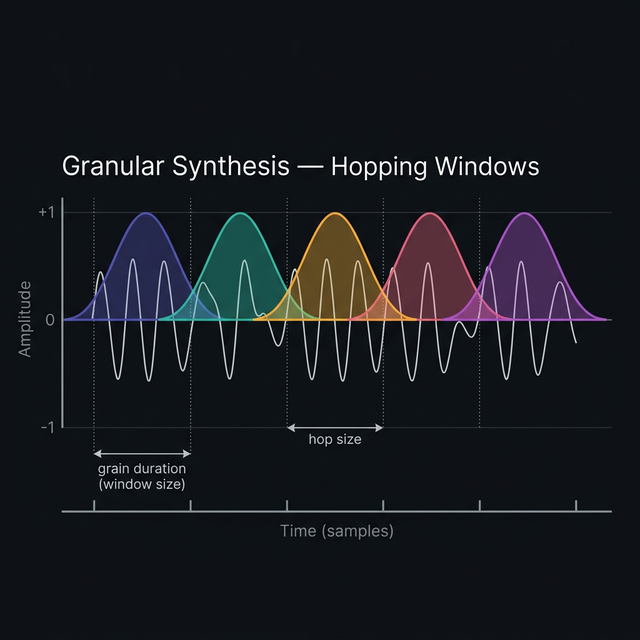
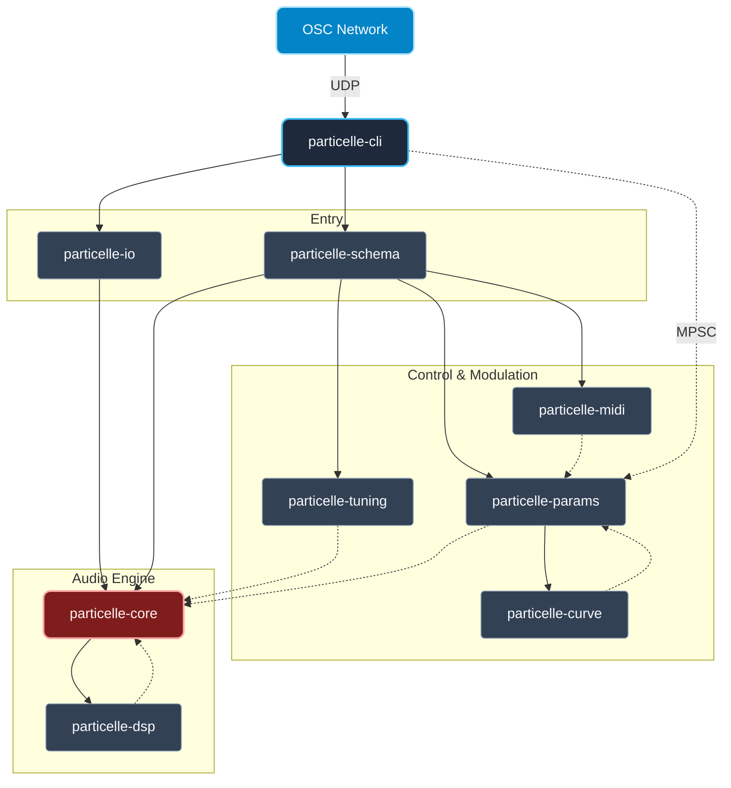
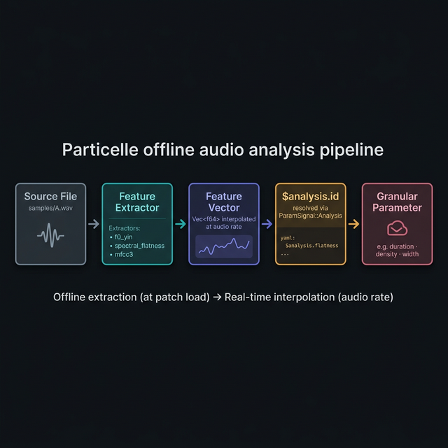
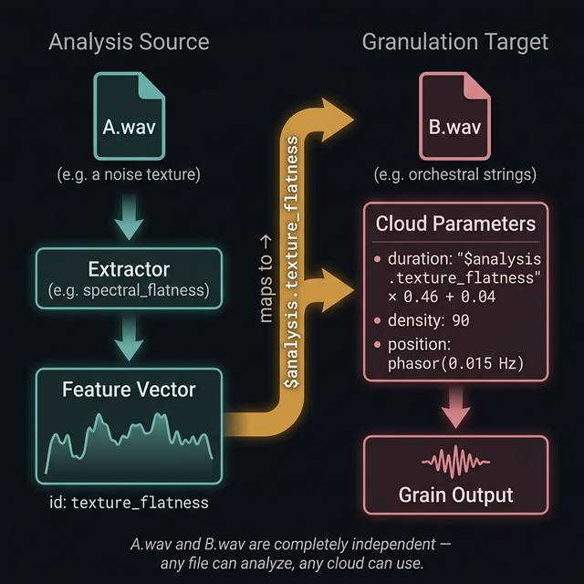
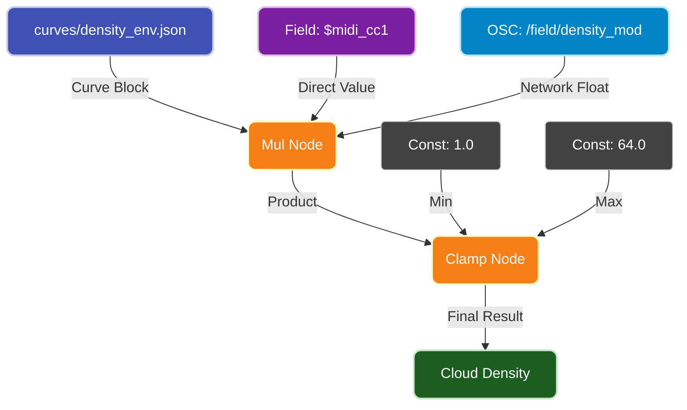

<p align="center">
  
</p>

# 🌬️ Particelle

**Sound, atomized. Every parameter a signal. Every result reproducible.**

Particelle is a 64-bit, research-grade, surround-native, LLM-controllable, microtonal-first, multichannel-native granular synthesis engine written entirely in Rust. Not a plugin. Not GUI-driven. Pure infrastructure--controlled through YAML and a CLI. Scatter millions of grains across a 64-channel Dolby Atmos spaces. Cross-couple any audio file's audio features to control granulation parameters of itself or another sound file. Tune in 31-EDO or load an included Scala scale. Render deterministically to 64-bit float WAV fioes, or run live to  your audio interfaces.

```sh
# 60 seconds to granular sound — no toolchain required
git clone https://github.com/TheColby/Particelle.git && cd Particelle && ./install.sh
particelle init > patch.yaml && particelle render patch.yaml -o out.wav --duration 10.0
```

---

## 🧭 Development Philosophy

Particelle is designed under two constraints that admit no exception:

1. **Architecture precedes implementation.** Crate boundaries are structural, not organizational. `particelle-core` has no dependency on I/O, YAML, or CLI. `particelle-cli` contains no audio logic. These are not conventions; they are encoded in the dependency graph.

2. **Precision is not negotiable.** Internal representation is `f64` everywhere. Pitch calculations, window values, interpolation coefficients, grain positions — nothing is stored or computed at lower precision than `f64`. The only exception is the hardware boundary, where `f32` may be required by the audio driver.

The project is designed to scale. Adding a new window type, a new curve shape, or a new tuning mode should require touching exactly one module without propagating changes through the codebase. Traits enforce the boundaries. Tests enforce the invariants.

This is a long-horizon platform. Compatibility, correctness, and architectural clarity take precedence over feature velocity.

---

## 📦 Installation

### ⚡ One-Liner

```sh
git clone https://github.com/TheColby/Particelle.git && cd Particelle && ./install.sh
```

### 🔧 From Source (manual)

```sh
# Clone the repository
git clone https://github.com/TheColby/Particelle.git
cd Particelle

# Build the release binary
cargo build --release

# The binary is at target/release/particelle
# Optionally, copy it somewhere on your PATH:
cp target/release/particelle /usr/local/bin/
```

### 📋 Requirements

- **Rust 1.70+** (install via [rustup.rs](https://rustup.rs/)). On mac, you can install [Homebrew](https://brew.sh) and do `brew install rust`.
- A C compiler for native audio dependencies (Xcode CLT on macOS, `build-essential` on Linux)

### ✅ Verify Installation

```sh
particelle --version
# → particelle 0.1.0
```

---

## 🆘 Help

Every subcommand has built-in help:

```sh
particelle --help
```

```
Usage: particelle <COMMAND>

Commands:
  render    Render a patch to an audio file (offline, deterministic)
  run       Run a patch in realtime on a hardware device
  validate  Check a YAML patch for schema errors
  init      Generate a default starter patch to stdout
  curve     Preview a JSON curve file

Options:
  -h, --help     Print help
  -V, --version  Print version
```

Individual subcommands:

```sh
particelle render --help
particelle run --help
particelle curve --help
```

---

## 🚀 60-Second Quick Start

### 🌱 1. Generate a starter patch

```sh
particelle init > my_first_patch.yaml
```

This writes a complete, valid YAML patch with sensible defaults (stereo, 48kHz, Hann window, single cloud).

### ✔️ 2. Validate it

```sh
particelle validate my_first_patch.yaml
# → ✓ Patch is valid. 1 cloud, 2 channels, 12-TET tuning.
```

### 🔊 3. Render to file

```sh
particelle render my_first_patch.yaml -o output.wav --duration 10.0
# → Rendering 10.0s @ 48000Hz … done. Wrote output.wav (960000 frames, 2 channels)
```

### ▶️ 4. Play in realtime

```sh
particelle run my_first_patch.yaml
# → Streaming to "Default Output" @ 48000Hz, 256 block … (Ctrl+C to stop)
```

### ⚡ Rapid Prototyping (No YAML Required)

For fast experimentation, you can pipe `particelle init` directly into `particelle render` using `sed` or `yq` to override parameters on the fly without writing any files to disk.

**Example: Render a 2-second pitch-shifted burst (-12 semitones)**
```sh
particelle init \
  | sed -e 's/playback_rate: 1.0/playback_rate: 0.5/' -e 's/duration: 0.1/duration: 0.5/' \
  | particelle render - -o downtuned.wav --duration 2.0
```

**Example: Fast asynchronous texture (high density, random position)**
```sh
particelle init \
  | sed -e 's/density: 10.0/density: 120.0/' -e 's/position: 0.5/position: "$random"/' \
  | particelle render - -o chaos.wav --duration 5.0
```

---


## 🎛️ Example Patches

### ✨ Example 1 — Stereo Shimmer

```yaml
engine:
  sample_rate: 48000
  block_size: 256

layout:
  channels:
    - { name: "L", azimuth_deg: -30.0, elevation_deg: 0.0 }
    - { name: "R", azimuth_deg:  30.0, elevation_deg: 0.0 }

clouds:
  - id: shimmer
    source: audio/music_example.wav
    density: 20.0
    duration: 0.12
    amplitude: 0.6
    position: 0.5
    window: { type: hann }
    listener_pos: { x: 0.0, y: 1.0, z: 0.0 }
    width: 0.3
```

```sh
particelle render shimmer.yaml -o shimmer.wav --duration 8.0
```

### ⏩ Example 2 — 4× Timestretch

Slow down a 4-second file to 16 seconds without changing pitch. The grain read position is driven by a linear curve that advances 4× slower than realtime:

```yaml
clouds:
  - id: stretch
    source: audio/music_example.wav
    density: 24.0
    duration: 0.08
    amplitude: 0.5
    window: { type: hann }
    listener_pos: { x: 0.0, y: 1.0, z: 0.0 }
    width: 0.8
    position:
      op: curve
      ref: "curves/stretch_pos.json"
```

The curve `curves/stretch_pos.json` maps 16s of clock time to 4s of file position:

### 🎹 Example 3 — Steve Reich Phase Effect

Granulate a mono sound file and pan two duplicate clouds hard left and right. Use programmatic `phasor` oscillators running at *slightly* different rates (0.100 Hz vs 0.101 Hz) to control the `position` parameter. The left and right channels will drift out of phase exactly like early Steve Reich tape experiments. No JSON curves required.

```yaml
engine:
  sample_rate: 48000
  block_size: 256

layout:
  channels:
    - { name: "L", type: spherical, azimuth_deg: -30.0, elevation_deg: 0.0 }
    - { name: "R", type: spherical, azimuth_deg:  30.0, elevation_deg: 0.0 }

clouds:
  - id: "left_phase"
    source: "audio/music_example.wav"
    density: 20.0
    duration: 0.2
    position:
      op: osc
      args: ["phasor", 0.100] # 10-second loop
    amplitude: 0.8
    window: { type: hann }
    listener_pos: { x: -1.0, y: 1.0, z: 0.0 } # Hard Left

  - id: "right_phase"
    source: "audio/music_example.wav"
    density: 20.0
    duration: 0.2
    position:
      op: osc
      args: ["phasor", 0.101] # Slightly faster loop
    amplitude: 0.8
    window: { type: hann }
    listener_pos: { x: 1.0, y: 1.0, z: 0.0 } # Hard Right
```

```sh
particelle render steve_reich_phase.yaml -o phased.wav --duration 60.0
```

```json
{
  "segments": [
    { "x": 0.0, "y": 0.0, "x_end": 16.0, "y_end": 4.0, "shape": "linear" }
  ],
  "extrapolation": { "left": "clamp", "right": "clamp" }
}
```

```sh
particelle render examples/stretch_4x.yaml -o stretched.wav --duration 16.0
```

### 🎼 Example 3 — 31-EDO Microtonal Drone

A dense grain cloud tuned to 31 equal divisions of the octave:

```yaml
engine:
  sample_rate: 96000
  block_size: 512

tuning:
  mode: edo
  steps: 31

layout:
  channels:
    - { name: "L", azimuth_deg: -30.0 }
    - { name: "R", azimuth_deg:  30.0 }

clouds:
  - id: drone
    source: samples/cello_sustain.flac
    density: 8.0
    duration: 0.5
    amplitude: 0.4
    position: 0.0
    window: { type: kaiser, beta: 8.6 }
    listener_pos: { x: 0.0, y: 1.5, z: 0.0 }
    width: 0.6
```

```sh
particelle render drone_31edo.yaml -o drone.wav --duration 30.0
```

### 🔊 Example 4 — 7.1.4 Immersive Spatialization

12-channel Atmos-compatible layout with grains drifting through 3D space:

```yaml
engine:
  sample_rate: 96000
  block_size: 256

layout:
  channels:
    - { name: "FL",  azimuth_deg: -30.0,  elevation_deg:  0.0 }
    - { name: "FR",  azimuth_deg:  30.0,  elevation_deg:  0.0 }
    - { name: "C",   azimuth_deg:   0.0,  elevation_deg:  0.0 }
    - { name: "LFE", azimuth_deg:   0.0,  elevation_deg:  0.0 }
    - { name: "BL",  azimuth_deg: -150.0, elevation_deg:  0.0 }
    - { name: "BR",  azimuth_deg:  150.0, elevation_deg:  0.0 }
    - { name: "SL",  azimuth_deg: -90.0,  elevation_deg:  0.0 }
    - { name: "SR",  azimuth_deg:  90.0,  elevation_deg:  0.0 }
    - { name: "TFL", azimuth_deg: -45.0,  elevation_deg: 45.0 }
    - { name: "TFR", azimuth_deg:  45.0,  elevation_deg: 45.0 }
    - { name: "TBL", azimuth_deg: -135.0, elevation_deg: 45.0 }
    - { name: "TBR", azimuth_deg:  135.0, elevation_deg: 45.0 }

clouds:
  - id: orbit
    source: samples/glass_textures.wav
    density: 16.0
    duration: 0.2
    amplitude: 0.5
    window: { type: tukey, alpha: 0.3 }
    listener_pos: { x: 0.0, y: 0.0, z: 0.0 }
    width: 0.5
    position:
      op: curve
      ref: "curves/spatial_orbit.json"
```

```sh
particelle render immersive.yaml -o atmos_orbit.wav --duration 60.0
```

### 🏎️ Example 5 — 384kHz DXD 64-Channel Stress Test

To truly test multicore hardware limits (like Apple M-Series chips), Particelle scales effortlessly to massive spatial arrays and extreme sample rates. This patch generates 250 grains per second per channel, calculating all mixing in 64-bit float across 64 discrete outputs at 384,000 Hz:

```yaml
engine:
  sample_rate: 384000.0   # 384 kHz DXD limit
  block_size: 1024
  max_particles_per_cloud: 16384

layout:
  channels:
    - { name: "CH01", azimuth_deg: 0.0, elevation_deg: 0.0 }
    - { name: "CH02", azimuth_deg: 5.6, elevation_deg: 0.0 }
    # ... 62 more channels spanning a 360-degree sphere ...

tuning:
  mode: twelve_tet

analysis:
  - id: source_bursts
    source: samples/drums.wav
    extractor: peak_amplitude

clouds:
  - id: dxd_orchestra
    source: samples/drums.wav
    density: 250.0   # 250 grains per second
    duration: 0.200  # 50x overlap per channel
    position: { op: osc, args: [phasor, 0.5] }
    amplitude:
      op: clamp
      args:
        - { op: mul, args: ["$analysis.source_bursts", 0.05] }
        - 0.0
        - 0.1
    window: { type: kaiser, beta: 10.0 }
    listener_pos: { x: 0.0, y: 1.0, z: 0.0 }
    width: 3.5  # Wide 64-channel dispersion
```

## 🗺️ Example Use Cases

Particelle's architecture supports a vast array of granular techniques natively. The `examples/` directory contains 150 distinct patch configurations to demonstrate the engine's versatility. They are organized by layout:

- **[Mono Examples](examples/mono/)**: 50 patches designed for single-channel evaluation or spatial routing preparation.
- **[Stereo Examples](examples/stereo/)**: 50 patches optimized for standard L/R headphones and speakers.
- **[Multichannel Examples](examples/multichannel/)**: 50 patches showcasing 8-channel wrap-around spatialization.

Each folder contains diverse granular techniques:
- **Texture**: High-density micro-grains (200+ per second) that dissolve transients.
- **Drone**: Long, overlapping Tuky-windowed grains (0.5s+) creating sustained ambient beds.
- **Time Stretch**: Grains that scan the file linearly using custom `curves/sweep_up.json` over long durations.
- **Pitch Shift**: Static file scanning, but explicit Just Intonation (`ji`) tuning adjustments to shift formants.
- **MPE**: Signal graphs tied to `$p_mod` (MIDI Polyphonic Expression Pressure) which dynamically scale the density in realtime.
- **Glitch & Chaos**: Highly randomized parameters using extreme boundary ranges.


---

## 🤔 Hold Up! What Is Granular Synthesis?

Granular synthesis is a method of sound generation that operates on a fundamentally different principle than traditional synthesis or sampling. Instead of playing back audio as a continuous stream, granular synthesis **breaks sound into hundreds or thousands or more of tiny fragments** — called *grains* — and reassembles them in new configurations.

### 🌾 The Grain

A grain is a short snippet of audio, typically between **1 and 200 milliseconds** long. Mathematically, a grain $g(t)$ is formed by multiplying a segment of source audio $x(t)$ starting at read position $\tau$ by a bell-shaped window function $w(t)$ over a duration $D$:

$$ g(t) = x(t + \tau) \cdot w\left(\frac{t}{D}\right) \quad \text{for } 0 \le t \le D $$

This windowing fades the grain smoothly in and out, preventing harsh clicks at the boundaries. A single grain sounds like almost nothing — a brief click or a wisp of tone. But when hundreds of grains are layered together per second, something remarkable happens: a continuous, evolving texture emerges from the aggregate. This is the central insight of granular synthesis.



*Each colored envelope is one grain — a short Hann-windowed segment. The grains hop forward by the **hop size** and overlap each other, producing a continuous output through overlap-add reconstruction.*


### ☁️ How It Works: The Cloud

A *cloud* is a stream of grains emitted over time. A cloud has parameters that control:

| Parameter | What it does |
|-----------|-------------|
| **Density** | How many grains per second are emitted (1–1000+) |
| **Duration** | How long each grain lasts (1ms–500ms) |
| **Position** | Where in the source audio each grain reads from |
| **Amplitude** | How loud each grain is |
| **Pitch/Rate** | The playback speed of each grain (affects pitch) |
| **Window** | The fade-in/fade-out envelope shape applied to each grain |
| **Spatial position** | Where the grain is placed in 3D space (for surround) |

#### The Hop Size and Overlap Factor

The **hop size** ($H_s$) is the time interval between successive grain onsets — essentially, how far the window "slides" between one grain and the next. In Particelle, hop size is the inverse of the **density** ($\delta$) parameter (grains per second):

$$ H_s = \frac{1}{\delta} $$

The **overlap factor** ($O$) is the ratio of grain duration ($D_g$) to hop size. It represents the average number of grains playing simultaneously:

$$ O = \frac{D_g}{H_s} = D_g \cdot \delta $$

At 50% overlap ($O = 2.0$), adjacent grains cross-fade smoothly through each other, producing a continuous, artifact-free texture — this is the regime shown in the plot above.

| Overlap Factor | Hop Size (for 50ms grain) | Sonic Character |
|:-:|:-:|---|
| **0.1×** | 500ms | Sparse, isolated events — pointillist, stochastic |
| **0.25×** | 200ms | Scattered droplets — grains separated by silence |
| **0.5×** | 100ms | Rhythmic pulse — grains with gaps, percussive feel |
| **1×** (no overlap) | 50ms | Back-to-back grains, choppy, percussive |
| **2×** (50% overlap) | 25ms | Smooth, continuous texture, minimal artifacts |
| **4×** (75% overlap) | 12.5ms | Dense, lush, blurred — spectral smearing |
| **8×** (87.5% overlap) | 6.25ms | Extremely dense, chorus-like, washy |
| **16×+** | <3ms | Approaching resynthesis; timbre transforms |

**Sub-unity overlap (<1×)** produces silence between grains. The lower the factor, the sparser the texture. At very low values (0.1×–0.25×), each grain is an isolated sonic event — you hear individual “droplets” or “particles” with audible gaps between them. This regime is ideal for pointillist composition, stochastic textures, and rhythmic granulation where the silence *between* grains is as important as the grains themselves.

**Low overlap (1×–2×)** preserves transients and rhythmic detail. Each grain is distinct; the source material’s attack characteristics survive. Useful for percussive textures, rhythmic granulation, and time-domain effects.

**High overlap (4×–16×)** blurs the source into a cloud where individual grains are no longer perceptible. The output becomes a spectral average of the source region. This is the classic “granular pad” sound — shimmering, suspended, and evolving. At very high overlap, the effect resembles spectral freezing.

In Particelle, hop size is derived from the **density** parameter (grains per second) and the grain **duration**. Both are full signals, meaning the overlap factor can evolve continuously over time under curve or MIDI control.

When density is high and duration is long enough for grains to overlap, the output sounds like a sustained, shimmering texture. When density is low, individual grains become audible as discrete sonic events — like raindrops on glass.

### 🪄 Creating Stutter Effects

Stutter and glitch effects in Particelle are created by manipulating **overlap** and **position**:

1. **Freeze Position**: Set `position` to a constant value (e.g., `0.5` for the middle of a file).
2. **Low Overlap**: Set `density` and `duration` so the overlap factor is **≤ 1.0**. Back-to-back grains (1.0×) create a rhythmic repeat. Gappy grains (<1.0×) create a choppy, isolated stutter.
3. **Short Duration**: Keep durations between 10ms and 50ms for that classic "glitch" sound rather than a recognizable loop.

```yaml
clouds:
  - id: stutter_glitch
    source: "audio/vocal.wav"
    density: 20.0        # 20 grains/sec
    duration: 0.02       # 20ms grains
    # overlap = 20 * 0.02 = 0.4 (gappy stutter)
    position: 0.25       # frozen at 25% through the file
    amplitude: 0.8
    window:
      type: "rectangular" # sharp edges for clicky stutters
```

### 💡 Why Is It Powerful?

Granular synthesis decouples properties that are normally locked together in recorded audio:

**Time and pitch become independent.** In normal playback, slowing down audio lowers its pitch. In granular synthesis, you can move through the source file at any speed (timestretching) while each grain plays back at the original pitch — or any other pitch you choose. A 4-second recording can become a 40-minute ambient piece without any change in timbre.

**Position becomes a parameter.** Instead of playing a file from start to finish, the read position can jump, freeze, reverse, scatter, or drift under curve or signal control. You can "freeze" on a single moment of a recording indefinitely, or scan through it in non-linear patterns.

**Space becomes a compositional dimension.** Each grain can be placed independently in a 3D listener space. A single source file can be scattered across a 12-channel speaker array, with each grain arriving from a different direction. Sound becomes sculptural.

### 🖼️ A Simple Analogy

Think of a photograph. Granular synthesis is like cutting the photograph into thousands of tiny tiles, then reassembling them — but now you can:

- Rearrange the tiles in any order
- Repeat certain tiles thousands of times
- Change the color of each tile independently
- Spread them across the walls of a room
- Control how fast you scan across them

The source material is still recognizable, but you have total control over its micro-structure.

### 🪟 The Role of the Window Function

Every grain is multiplied by a *window function* — a bell-shaped curve that smoothly fades the grain in and out. Without windowing, each grain would start and stop abruptly, producing harsh clicks at the boundaries.


Different window shapes produce different timbral qualities. A Hann window gives a soft, warm overlap. A Kaiser window with a high beta produces a tighter, more focused grain. Particelle includes **35+ window types** precisely because the window is one of the most expressive parameters in granular synthesis.

### 🌍 Where Granular Synthesis Is Used

- **Ambient and electroacoustic music** — timestretching, texture generation, spectral freezing
- **Film and game audio** — creating evolving atmospheric soundscapes from short recordings
- **Sound design** — transforming mundane recordings into otherworldly textures
- **Scientific research** — auditory perception studies, acoustic ecology, spatial audio experiments
- **Live performance** — real-time granular processing of live instruments or voice
- **Installation art** — long-duration generative pieces running unattended for hours or days

### 🌀 Granular Synthesis in Particelle

Particelle takes these ideas and builds them into a **production-grade, multichannel, microtonal, deterministic engine**. Every parameter listed above — density, duration, position, amplitude, pitch, window, spatial position — is a full signal in Particelle. That means each parameter can be a constant, a time-varying curve, a MIDI controller, an MPE expression, or an arithmetic combination of all of the above. There are no fixed parameters and no special cases.

---

## 🦄 What Makes Particelle Different

### 🔈 Surround-Native from the First Buffer

Particelle does not retrofit stereo to surround. The internal audio model is multichannel-native at the type level. Channels carry metadata — name, azimuth, elevation — and the engine operates over arbitrary discrete layouts including 2ch, 5.1, 7.1.4, and custom configurations up to any channel count. Grain positioning is computed in 3D listener space and distributed across channels via a `Spatializer` trait. There is no stereo assumption anywhere in the codebase.

### 🎵 Microtonal-First

The tuning subsystem is not an add-on. It is a load-bearing part of the signal chain. Supported tuning models include arbitrary EDO systems, fixed Just Intonation via rational ratios, and Scala format (`.scl` and `.kbm`). The complete pitch pipeline — from scale degree through pitchbend, curve offsets, and modulation — operates in `f64` at every step. There is no rounding in the frequency domain.

MPE (MIDI Polyphonic Expression) integrates natively: per-note pitchbend, pressure, and timbre are first-class signals routed directly into the parameter graph.

### 📡 Full Parameter Signal Graph

In Particelle, parameters are not values. They are signals. `ParamSignal` is a composable expression graph: constants, curves, control inputs, sums, products, maps, and clamps all compose into a unified signal that resolves to `f64` at render time. There are no special-cased parameters. No parameter bypasses the graph.

YAML declares every parameter. JSON control-point curves express temporal behavior. Control-rate values are upsampled to audio rate through configurable reconstruction methods including ZOH, linear, cubic, monotone cubic, sinc interpolation, one-pole and two-pole filters, slew limiters, and MinBLEP step reconstruction.

### 🔁 Deterministic Offline Rendering

Any patch that runs in realtime can run offline with byte-identical output given equal inputs. Randomness is seeded and deterministic. Offline renders are batchable and scriptable. Hash-based regression testing is a first-class part of the test suite.

### 🪗 35+ Window Types

The windowing system covers standard research windows (Hann, Hamming, Blackman-Harris, Kaiser, DPSS, Dolph-Chebyshev) and specialized variants (Planck taper, KBD, asymmetric Tukey, Rife-Vincent, user-defined cosine sum). All windows are generated in `f64`, cached by spec and length, and normalized by peak, RMS, or sum as specified. No window is computed more than once per session.

### 🦀 Rust Architecture

Particelle is written entirely in Rust. The realtime audio callback performs zero heap allocation. Lock-free queues separate the audio thread from all I/O. Internal precision is `f64` throughout. The hardware boundary converts to `f32` only at the device interface, if required by the driver. Thread safety is guaranteed by the type system.

---

## 🎯 Who Particelle Is For

Particelle is designed for:

- Microtonal composers working in EDO, JI, or Scala tuning systems
- Immersive audio composers and installation artists working in surround and spatial formats
- Spatial audio researchers building reproducible experimental workflows
- Algorithmic composition researchers who require deterministic, batchable rendering
- Developers building sound systems that require formal architectural boundaries

Particelle is not designed for:

- Casual preset-driven production
- GUI-centric workflows
- Users who need a DAW plugin

If you are looking for a visual instrument, Particelle is not the right tool. If you are building infrastructure for a complex compositional system, it may be exactly right.

---

## 📚 Core Concepts

| Concept | Description |
|---------|-------------|
| **Matter** | The source audio material a cloud reads grains from. May be a file on disk or a realtime input stream. |
| **Cloud** | A grain emitter. Owns an `EmitterParams` struct specifying density, duration, position, rate, amplitude, spread, and spatial position. Multiple clouds may run simultaneously over the same or different Matter sources. |
| **Particle** | A single active grain. Has a read position, playback rate, elapsed duration, window phase, 3D position, and pre-computed per-channel gains. Particles are pooled; no allocation occurs during grain scheduling. |
| **Field** | A named scalar value in the signal routing layer. Fields are populated by MIDI, MPE, or external control, and are readable by `ParamSignal::Control` nodes. |
| **ParamSignal** | A composable signal expression. Variants: `Const`, `Curve`, `Control`, `Sum`, `Mul`, `Map`, `Clamp`, `ScaleOffset`. All variants resolve to `f64`. Signal graphs are constructed from YAML and evaluated per-block at render time. |
| **Curve** | A JSON-defined control-point curve. Segments carry an explicit shape per interval. Curves are compiled before rendering. Evaluation inside the audio loop is a direct function call with no parsing and no allocation. |
| **Tuning** | An implementation of the `Tuning` trait. Converts scale degrees to frequencies in `f64`. The broader pitch pipeline applies MPE pitchbend, curve offsets, and modulation on top of the tuning frequency before computing playback ratio. |
| **Spatializer** | A trait defining how a grain's 3D position and width are distributed as per-channel gain values. The default implementation uses amplitude panning. The interface is open for VBAP, HRTF, and other methods. |

---

## 🏗️ Architecture Overview



All internal audio data is `f64`. Multichannel buffers are planar: one `Vec<f64>` per channel. The block size and sample rate are fixed at engine initialization. Frame time is tracked as a monotonic `u64`.

Curves are compiled from JSON into efficient evaluators before the first block is processed. Windows are computed once, cached by `(WindowSpec, length, normalization)`, and returned as shared `Arc<[f64]>` slices. No window is recomputed during rendering.

The engine runs identically in offline mode (writing to file) and realtime mode (driving a hardware device). The audio callback in realtime mode performs no heap allocation. A lock-free ring buffer separates the audio thread from all I/O operations.

---

## 📐 DSP Architecture & Formal Algorithms

Particelle prioritizes mathematical rigor. All internal processing evaluates continuously in double-precision (`f64`). Below are the foundational models driving the engine's core capabilities.

### 1. Spatialization: Vector Base Amplitude Panning (VBAP)
When routing thousands of grains across an immersive multichannel dome (e.g. 7.1.4 Atmos or 64-channel arrays), Particelle avoids legacy stereo panning laws. Instead, it utilizes VBAP. Given a virtual source unit vector $\mathbf{p}$ and a matrix mapping the active speaker triplet $\mathbf{L}$, the channel gain vector $\mathbf{g}$ is computed as:
$$ \mathbf{g} = \mathbf{p}^T \mathbf{L}^{-1} $$
Constant-power normalization is rigidly enforced across the output vector:
$$ \mathbf{g}_{\text{norm}} = \frac{\mathbf{g}}{\sqrt{\mathbf{g}^T \mathbf{g}}} $$

### 2. Spatialization: Binaural HRTF (Spherical Head Model)
When operating in binaural mode, Particelle utilizes a Head-Related Transfer Function (HRTF) to spatialize 3D coordinates onto a standard 2-channel headphone mix. The frequency-independent Interaural Intensity Difference (IID) for a spherical head is modeled as a function of the incidence angle $\theta$ to the ear:
$$ \text{IID}(\theta) = \alpha_{\text{min}} + (1 - \alpha_{\text{min}}) \left( \frac{\cos(\theta) + 1}{2} \right)^{1.5} $$
Where $\alpha_{\text{min}}$ represents the maximum acoustic shadow attenuation (typically $\sim 15\text{dB}$).

### 3. Spatialization: Higher-Order Ambisonics (HOA)
For isotropic, format-agnostic immersive rendering, Particelle natively encodes virtual sources into **AmbiX (ACN/SN3D)** format up to 3rd order (16 channels). 
The spatial encoding leverages Spherical Harmonics $Y_l^m(\theta, \phi)$, derived from the Associated Legendre Polynomials $P_l^m(\cos\theta)$:
$$ Y_l^m(\theta, \phi) = N_l^{|m|} P_l^{|m|}(\cos\theta) \begin{cases} 
\sin(|m|\phi) & \text{if } m < 0 \\
\cos(m\phi) & \text{if } m \ge 0 
\end{cases} $$
Where $N_l^{|m|}$ is the SN3D normalization factor. This allows grain positions in $x, y, z$ to seamlessly map into quadrupolar ($l=2$) and octupolar ($l=3$) acoustic velocity and gradient fields.

### 4. Feature Extraction: YIN Pitch Tracking ($f_0$)
The `particelle-analysis` crate extracts fundamental pitch tracks offline using the YIN algorithm. The core of YIN rests on the Cumulative Mean Normalized Difference Function (CMNDF) $d'_t(\tau)$, which minimizes errors over lag period $\tau$:
$$ d'_t(\tau) = \begin{cases} 
1 & \text{if } \tau = 0 \\
\frac{d_t(\tau)}{\frac{1}{\tau} \sum_{j=1}^{\tau} d_t(j)} & \text{if } \tau > 0 
\end{cases} $$
Where $d_t(\tau)$ is the squared difference function.

### 4. Feature Extraction: Spectral Centroid & Entropy
Grains can map their length or spatial origin to the acoustic brightness of a secondary file.
**Spectral Centroid** determines the "center of mass" of the magnitude spectrum $X(k)$ across linear frequency bins $f(k)$:
$$ C = \frac{\sum_{k=0}^{N-1} f(k) X(k)}{\sum_{k=0}^{N-1} X(k)} $$
**Spectral Entropy** calculates the randomness (tonality vs. noise) by treating the normalized power spectrum $\hat{P}(k)$ as a probability mass function in Shannon's entropy formula:
$$ H = -\sum_{k=0}^{N-1} \hat{P}(k) \log_2 \hat{P}(k) $$

### 5. Window Generators: The Kaiser Window
Particelle generates all of its extremely high-fidelity grain envelopes (35+ types) offline in `f64` into static `Arc<[f64]>` tables before rendering. The highly sought-after Kaiser window explicitly balances main-lobe width against side-lobe attenuation using $\beta$ via the modified Bessel function of the first kind $I_0$:
$$ w(n) = \frac{I_0 \left( \pi \beta \sqrt{ 1 - \left( \frac{2n}{N-1} - 1 \right)^2 } \right)}{I_0(\pi \beta)} \quad \text{for } 0 \le n \le N-1 $$

---

## 🌪️ Phase 24 (Upcoming): Stochastic & Chaotic Modulators

Particelle is currently implementing an expansive library of non-linear, chaotic, and stochastic generators for the `ParamSignal` AST. These modules will allow for the deterministic generation of complex, evolving macro-structures without relying on large external curve files. 

These generators are calculated sample-for-sample in `f64` within the signal graph and can drive any parameter from grain density to 3D spatial position.

### 1. Chaotic Attractors

**Lorenz System:** A set of coupled, non-linear ordinary differential equations. By tapping into the $x$, $y$, or $z$ dimension of the solved system, users can generate smooth but permanently unpredictable modulation paths that never repeat.
$$ \frac{dx}{dt} = \sigma (y - x) $$
$$ \frac{dy}{dt} = x (\rho - z) - y $$
$$ \frac{dz}{dt} = xy - \beta z $$

**Rössler Attractor:** Similar to Lorenz but designed to have a simpler phase space, producing signals that dwell in harmonic-like cycles before periodically erupting into chaos.
$$ \frac{dx}{dt} = -y - z $$
$$ \frac{dy}{dt} = x + ay $$
$$ \frac{dz}{dt} = b + z(x - c) $$

**Hénon Map:** A discrete-time dynamical system. Because it is calculated iteratively rather than continuously, it produces highly jagged, granular sequences of values perfect for stochastic pitch quantization or erratic spatial scattering.
$$ x_{n+1} = 1 - a x_n^2 + y_n $$
$$ y_{n+1} = b x_n $$

### 2. Stochastic & Noise Models

- **Brownian Motion (Random Walk):** A continuously accumulated random value where the derivative (step size) is Gaussian. Excellent for simulating natural analog drift in tuning or density over long durations.
$$ X_{t+dt} = X_t + \mathcal{N}(0, \sigma^2 \cdot dt) $$
- **Pink Noise ($1/f$):** Equal energy per octave. Mathematically modeled via the Voss-McCartney algorithm. Highly musical for modulating grain durations as it avoids the harsh jitter of white noise.
- **Perlin & Simplex Noise:** Continuous gradient noise in 1D, 2D, or 3D space. By sweeping a clock through 3D Simplex space, smooth, organic, landscape-like modulation curves are generated.

### 3. Usage Example (Preview)

Once Phase 24 is merged, these nodes will integrate directly into the `op` graph:

```yaml
position:
  op: lorenz
  args:
    - 10.0  # sigma
    - 28.0  # rho
    - 2.66  # beta
    - "x"   # output dimension
    - 0.01  # timestep (speed)
```

---

## 📡 OSC (Open Sound Control) Telemetry

To modify engine parameters in realtime from external applications (Max/MSP, SuperCollider, TouchOSC), Particelle provides a lightweight, non-blocking UDP receiver thread that bypasses the parser entirely. 

To enable OSC, launch your patch with the network port flag:

```bash
particelle run patch.yaml --osc-port 9000
```

Any OSC messages received at `0.0.0.0:9000` matching the address pattern `/field/<name>` will directly inject their numeric value into the `$name` control field graph, updating instantly on the next audio frame processing tick. 

For example, sending `12.5` to `/field/density` will override a YAML node parameterized as `"$density"`.

---

## 🤖 AI-Assisted Patch Generation

Particelle's YAML schema is precisely documented to work seamlessly with Large Language Models. There are two ways to use this:

### 🖥️ Option A: `ai2yaml` CLI (Recommended)

The included `ai2yaml` script wraps the system prompt automatically, calls your LLM of choice, extracts the YAML from the response, and writes it directly to a file:

```bash
# Install one API client
pip install openai           # for OpenAI (default)
pip install google-genai     # for Gemini (--api gemini)
pip install anthropic        # for Claude (--api claude)

# Set your API key
export OPENAI_API_KEY="sk-..."

# Generate a patch from a plain-English description
./ai2yaml "granulate A.wav using its pitch analysis to control hop size" my_patch.yaml

# Validate the generated file
particelle validate my_patch.yaml

# Render it
particelle render my_patch.yaml -o output.wav --duration 30.0
```

Supported backends and models:

```bash
./ai2yaml "dense 31-EDO drone panning in a circle" patch.yaml --api openai --model gpt-4o
./ai2yaml "choir granulated by its own flatness curve" patch.yaml --api gemini --model gemini-2.0-flash
./ai2yaml "textural wash from piano samples" patch.yaml --api claude --model claude-opus-4-5
```

### 📋 Option B: Copy-Paste Prompt (Browser / Chat UIs)

Paste the contents of [`docs/AI_PATCH_GENERATOR.md`](docs/AI_PATCH_GENERATOR.md) into any LLM's custom instructions or first message, then describe your desired patch in natural language:

> *"Give me a Particelle configuration for a 60-second drone. Pan it continuously in a circle using an LFO. Map it to 31-EDO tuning. Make the density chaotic."*

### 🍳 Recipe Gallery (`examples/ai2yaml/`)

The `examples/ai2yaml/` folder contains 10 fully-annotated, ready-to-run patches — each includes the original plain-English prompt that generated it:

| File | Prompt Concept |
|---|---|
| [`01_31edo_drone.yaml`](examples/ai2yaml/01_31edo_drone.yaml) | Dense 31-EDO cello drone circling in 4-channel surround |
| [`02_pitch_follower.yaml`](examples/ai2yaml/02_pitch_follower.yaml) | Grain duration driven by F0 of the same vocal source |
| [`03_spectral_shimmer.yaml`](examples/ai2yaml/03_spectral_shimmer.yaml) | Cross-file: noise file's spectral flatness shapes orchestral grain size |
| [`04_percussive_freeze.yaml`](examples/ai2yaml/04_percussive_freeze.yaml) | Percussive transient freeze-bloom (8ms → 800ms grain morph) |
| [`05_atmos_rain.yaml`](examples/ai2yaml/05_atmos_rain.yaml) | 12-channel 7.1.4 spatial rain cloud |
| [`06_sidechain_gate.yaml`](examples/ai2yaml/06_sidechain_gate.yaml) | Kick drum RMS ducks the amplitude of a granulated pad |
| [`07_chaotic_lfo_swarm.yaml`](examples/ai2yaml/07_chaotic_lfo_swarm.yaml) | Three interlocking prime-ratio phasor LFOs controlling three separate clouds |
| [`08_chroma_driven_pan.yaml`](examples/ai2yaml/08_chroma_driven_pan.yaml) | Dominant chroma pitch class sweeps spatial width and amplitude |
| [`09_mfcc_texture.yaml`](examples/ai2yaml/09_mfcc_texture.yaml) | MFCC-3 drives grain width for dynamic timbral morphing |
| [`10_polyrhythmic_bursts.yaml`](examples/ai2yaml/10_polyrhythmic_bursts.yaml) | Three simultaneous clouds at prime density ratios in Just Intonation |
| [`11_arabic_microtonal.yaml`](examples/ai2yaml/11_arabic_microtonal.yaml) | 24-tone Arabic Scala tuning with breathing amplitude LFO |
| [`12_granular_reverb_tail.yaml`](examples/ai2yaml/12_granular_reverb_tail.yaml) | 4-channel granular reverb tail with Kaiser window |
| [`13_reverse_scrub.yaml`](examples/ai2yaml/13_reverse_scrub.yaml) | Reverse scrub through ocean.wav in 5.1 surround |
| [`14_dual_source_layer.yaml`](examples/ai2yaml/14_dual_source_layer.yaml) | Dense bass + sparse pad from two different source files |
| [`15_flux_phoneme_gate.yaml`](examples/ai2yaml/15_flux_phoneme_gate.yaml) | Spectral flux of speech gates grain density of a background texture |
| [`16_inharmonicity_follower.yaml`](examples/ai2yaml/16_inharmonicity_follower.yaml) | Bell inharmonicity inversely controls grain duration |
| [`17_mfcc_triple_cloud.yaml`](examples/ai2yaml/17_mfcc_triple_cloud.yaml) | Three clouds each driven by a different MFCC coefficient |
| [`18_zcr_wind_turbulence.yaml`](examples/ai2yaml/18_zcr_wind_turbulence.yaml) | ZCR of wind.wav drives cloud density — calm to turbulent |
| [`19_attack_time_density.yaml`](examples/ai2yaml/19_attack_time_density.yaml) | Log attack time sets a fixed grain density (pluck vs. bow) |
| [`20_thunder_height_cloud.yaml`](examples/ai2yaml/20_thunder_height_cloud.yaml) | 8-channel hemispherical thunder cloud with height speakers |
| [`21_bohlen_pierce_pad.yaml`](examples/ai2yaml/21_bohlen_pierce_pad.yaml) | Three-layer pad in Bohlen-Pierce 13-step tritave tuning |
| [`22_entropy_spatial_width.yaml`](examples/ai2yaml/22_entropy_spatial_width.yaml) | Spectral entropy drives grain scatter across 8 immersive channels |
| [`23_breathing_loop.yaml`](examples/ai2yaml/23_breathing_loop.yaml) | Looping flute texture with breath LFO + subtle 60 Hz tremolo |
| [`24_micro_montage.yaml`](examples/ai2yaml/24_micro_montage.yaml) | Four micro-sources merged into a composite texture at 5ms grains |
| [`25_granular_pitch_shift.yaml`](examples/ai2yaml/25_granular_pitch_shift.yaml) | Two passes of guitar.wav — root plus minor third down |
| [`26_loudness_scatter.yaml`](examples/ai2yaml/26_loudness_scatter.yaml) | dBFS loudness inversely controls spatial scatter width |
| [`27_tritone_chroma_position.yaml`](examples/ai2yaml/27_tritone_chroma_position.yaml) | C# vs G# chroma rivalry modulates scrub position |
| [`28_three_tier_ambient.yaml`](examples/ai2yaml/28_three_tier_ambient.yaml) | Slow/mid/fast grain tiers layered for generative ambient |
| [`29_harmonic_ratio_density.yaml`](examples/ai2yaml/29_harmonic_ratio_density.yaml) | Harmonic ratio inverted to density; crest factor gates amplitude |
| [`30_cinematic_impact.yaml`](examples/ai2yaml/30_cinematic_impact.yaml) | One-shot impact: density 400, duration and amplitude chase phasor |

To regenerate any recipe from its prompt:
```bash
./ai2yaml "<prompt from top of file>" my_version.yaml
```


---

## 🔬 Offline Audio Feature Analysis

The `analysis` block extracts time-varying acoustic feature vectors from source files offline (before rendering begins). These vectors are then interpolated at audio rate and exposed as `$analysis.<id>` references anywhere in the parameter graph. The source file in `analysis` blocks is independent of — and can be completely different from — the cloud's granular source.



*Feature extraction runs once at patch load time. The resulting `Vec<f64>` is then interpolated at audio rate during rendering/realtime performance.*

Because the analysis source is **independent of the granulation source**, you can cross-couple any file to any cloud:



**Supported extractors (30+):**

*Pitch & Tonality*

| Extractor | Output | Description |
|---|---|---|
| `f0_yin` | Hz | Fundamental frequency via YIN algorithm |
| `harmonic_ratio` | 0–1 | Autocorrelation-based harmonics-to-noise ratio (HNR) |
| `inharmonicity` | 0–1 | Average partial deviation from ideal harmonic series |
| `tristimulus1` | 0–1 | Ratio of fundamental energy to total spectral energy |

*Spectral Magnitude*

| Extractor | Output | Description |
|---|---|---|
| `spectral_centroid` | Hz | Spectral center of mass ("brightness") |
| `spectral_spread` | Hz | Standard deviation of energy around centroid |
| `spectral_skewness` | — | Asymmetry of spectral distribution (3rd moment) |
| `spectral_kurtosis` | — | "Tailedness" of spectral distribution (4th moment) |
| `spectral_rolloff` | Hz | Frequency below which 85% of energy lies |
| `spectral_crest` | ratio | Peak power / mean power |
| `spectral_flatness` | 0–1 | 0 = tonal, 1 = white noise (Wiener Entropy) |
| `spectral_entropy` | 0–1 | Information entropy of the normalised spectrum |
| `spectral_flux` | ≥0 | Half-wave rectified L2 norm of successive spectra |
| `spectral_contrast` | — | Peak-valley sub-band contrast (6 octave bands) |

*Perceptual (MFCCs)*

| Extractor | Output | Description |
|---|---|---|
| `mfcc1`–`mfcc12` | — | Mel-Frequency Cepstral Coefficients 1–12 via 26-band Mel filterbank + DCT-II |

*Dynamics*

| Extractor | Output | Description |
|---|---|---|
| `rms` | 0–1 | Root-Mean-Square amplitude envelope |
| `peak_amplitude` | 0–1 | Per-window absolute peak |
| `loudness_dbfs` | –96–0 dBFS | RMS-based loudness in decibels |
| `crest_factor` | ratio | Peak / RMS (impulsiveness) |
| `log_attack_time` | log(sec) | Log10 of the onset-to-peak attack time (global) |

*Temporal*

| Extractor | Output | Description |
|---|---|---|
| `zero_crossing_rate` | 0–1 | Normalized sign changes per window (noisiness proxy) |

*Chroma / Pitch Class*

| Extractor | Output | Description |
|---|---|---|
| `chroma_active_class` | 0–11 | Most energetically active pitch class (0=C, 11=B) |
| `chroma_strength` | ≥0 | Standard deviation across chroma bins (tonality dominance) |
| `chroma_C` … `chroma_B` | 0–1 | Normalized energy for a specific pitch class (also `chroma_Cs`, `chroma_Ds`, `chroma_Fs`, `chroma_Gs`, `chroma_As`) |


**Example — use `A.wav`'s spectral flatness to shape grains on `B.wav`:**

```yaml
analysis:
  - id: texture_flatness
    source: samples/A.wav
    extractor: spectral_flatness

clouds:
  - id: melodic_granulated
    source: samples/B.wav
    duration:
      op: add
      args:
        - 0.04                          # 40ms minimum
        - op: mul
          args:
            - "$analysis.texture_flatness"
            - 0.46                      # scale to 460ms at max flatness
```

See more examples in `examples/analysis/`.

---

## 📝 YAML-Centric Workflow

All engine behavior is declared in YAML. There are no hidden parameters. No behavior is configured through code paths that bypass the schema. The YAML file is the complete, reproducible description of a patch.

```yaml
engine:
  sample_rate: 96000
  block_size: 256

layout:
  channels:
    - { name: "L",   azimuth_deg: -30.0, elevation_deg: 0.0 }
    - { name: "R",   azimuth_deg:  30.0, elevation_deg: 0.0 }
    - { name: "C",   azimuth_deg:   0.0, elevation_deg: 0.0 }
    - { name: "LFE", azimuth_deg:   0.0, elevation_deg: 0.0 }
    - { name: "Ls",  azimuth_deg: -110.0, elevation_deg: 0.0 }
    - { name: "Rs",  azimuth_deg:  110.0, elevation_deg: 0.0 }

tuning:
  mode: edo
  steps: 31

clouds:
  - id: shimmer
    source: samples/sustained_string.flac
    density: { op: mul, args: [16.0, "$density_mod"] }
    duration: 0.18
    amplitude: 0.6
    window:
      type: hann
    listener_pos: { x: 0.0, y: 1.5, z: 0.0 }
    width: 0.4
```

Curves are defined in separate JSON files and referenced by name:

```json
{
  "segments": [
    { "x": 0.0, "y": 0.0, "x_end": 4.0, "y_end": 1.0, "shape": "smootherstep" },
    { "x": 4.0, "y": 1.0, "x_end": 8.0, "y_end": 0.2, "shape": { "exp": { "k": 3.0 } } }
  ],
  "extrapolation": { "left": "clamp", "right": "clamp" }
}
```

CLI usage:

```sh
# Validate a patch
particelle validate patch.yaml

# Render to file
particelle render patch.yaml -o output.wav --duration 120.0

# Run in realtime
particelle run patch.yaml

# Generate a default patch
particelle init > patch.yaml

# Preview a curve
particelle curve curves/density.json --resolution 1000
```

---

## 🎶 Microtonal Workflow

Particelle treats tuning as a structural element, not a parameter. The scale is declared in YAML and applies globally to all clouds that reference degrees rather than raw frequencies.

**31-EDO drone:**

```yaml
tuning:
  mode: edo
  steps: 31
```

**Just Intonation:**

```yaml
tuning:
  mode: ji
  ratios:
    - { degree: 0, num: 1,  den: 1  }
    - { degree: 1, num: 9,  den: 8  }
    - { degree: 2, num: 5,  den: 4  }
    - { degree: 3, num: 4,  den: 3  }
    - { degree: 4, num: 3,  den: 2  }
    - { degree: 5, num: 5,  den: 3  }
    - { degree: 6, num: 15, den: 8  }
```

**Scala format:**

```yaml
tuning:
  mode: scala
  scl_path: scales/partch_43.scl
  kbm_path: scales/partch_43.kbm
```

The full pitch pipeline for a grain: 


Continuous pitch logic is maintained throughout. For an $E$-EDO system, the base frequency $f(n)$ for a fractional scale degree $n$ relative to a reference frequency $f_{\text{ref}}$ is:

$$ f(n) = f_{\text{ref}} \cdot 2^{\frac{n}{E}} $$

Modulation ($\Delta$, in cents) from MIDI pitchbend or parameter curves is applied exponentially:

$$ f_{\text{final}} = f(n) \cdot 2^{\frac{\Delta}{1200}} $$

All arithmetic is `f64`. No conversion to `f32` occurs before the hardware boundary.

MPE pitchbend range is configurable per voice. Per-note pressure and timbre are routed into the ParamSignal graph as named Fields.

---

## 🌐 Surround and Spatial Workflow

Layouts are declared declaratively. Any number of channels with any position may be specified. The engine supports both Spherical (Azimuth/Elevation) and Cartesian (X/Y/Z) coordinates.

**Spherical / Dolby Atmos style (degrees):**
```yaml
layout:
  channels:
    - { name: "FL",  azimuth_deg: -30.0,  elevation_deg:  0.0 }
    - { name: "FR",  azimuth_deg:  30.0,  elevation_deg:  0.0 }
    - { name: "C",   azimuth_deg:   0.0,  elevation_deg:  0.0 }
    - { name: "LFE", azimuth_deg:   0.0,  elevation_deg:  0.0 }
    - { name: "BL",  azimuth_deg: -150.0, elevation_deg:  0.0 }
    - { name: "BR",  azimuth_deg:  150.0, elevation_deg:  0.0 }
    - { name: "TFL", azimuth_deg:  -45.0, elevation_deg: 45.0 }
    - { name: "TFR", azimuth_deg:   45.0, elevation_deg: 45.0 }
    - { name: "TBL", azimuth_deg: -135.0, elevation_deg: 45.0 }
    - { name: "TBR", azimuth_deg:  135.0, elevation_deg: 45.0 }
    - { name: "TC",  azimuth_deg:   0.0,  elevation_deg: 90.0 }
    - { name: "BC",  azimuth_deg:   0.0,  elevation_deg: -45.0 }
```

**Cartesian style (meters):**
```yaml
layout:
  channels:
    - { name: "FL", x: -1.0, y:  1.0, z: 0.0 }
    - { name: "FR", x:  1.0, y:  1.0, z: 0.0 }
    - { name: "BL", x: -1.0, y: -1.0, z: 0.0 }
    - { name: "BR", x:  1.0, y: -1.0, z: 0.0 }
```

Each grain carries a position in 3D listener space (`x`, `y`, `z`). The `Spatializer` trait computes per-channel gains from that position and the channel layout. Position can be signal-driven: a curve can move a grain cluster through space over time.

Hardware output is multichannel-native. The CPAL backend is configured to request the full channel count declared in the layout. No downmixing is applied by the engine.

---

## ⚙️ Automation System

The automation system in Particelle is not a modulation matrix. It is a signal composition graph. Any parameter can be expressed as a function of time, control input, or other parameters, without limit.

Supported segment shapes in JSON curves:

| Family | Shapes |
|--------|--------|
| Basic | `hold`, `linear` |
| Smooth | `smoothstep`, `smootherstep`, `sine`, `cosine`, `raised_cosine` |
| Ease | `ease_quad`, `ease_cubic`, `ease_quart`, `ease_quint` (each with `in`, `out`, `in_out`) |
| Exponential | `exp(k)`, `log(k)`, `power(p)` |
| Spline | `catmull_rom`, `cubic_hermite`, `monotone_cubic` |

Supported control-rate to audio-rate reconstruction:

`zoh` · `linear` · `cubic` · `monotone_cubic` · `sinc(taps)` · `one_pole` · `two_pole` · `slew_limiter` · `minblep_step`

Signal expressions compose. Here is a visual representation of how a density parameter might be routed:



```yaml
density:
  op: clamp
  args:
    - op: mul
      args: [{ op: curve, ref: "curves/density_env.json" }, "$midi_cc1"]
    - 1.0
    - 64.0
```

The curve is evaluated at control rate. The result is multiplied by a MIDI CC field. The product is clamped. This expression is compiled before rendering and evaluated without allocation per block.

---

## 🎛️ Realtime Hardware Support

```yaml
hardware:
  device_name: "Focusrite USB Audio"
  latency_ms: 5.0
  duplex: false
```

The realtime mode selects a device by name, configures the sample rate and block size from the engine config, and opens a multichannel output stream. Duplex mode enables audio input, which becomes available as Matter for clouds.

MIDI and MPE are ingested off the audio thread and pushed into a lock-free ring buffer. The audio thread reads events from the queue without blocking. No MIDI parsing or event dispatch occurs on the audio thread.

The internal f64 buffers are converted to f32 only at the hardware output boundary, if the driver requires it. The engine never operates in f32 internally.

Offline and realtime modes share the same engine core. A deterministic offline render of a given patch is byte-identical across runs with equal inputs.

---

## 📖 Selected References (Foundational Literature)

1. **Gabor, Dennis (1946)** — *Theory of communication. Part 1: The analysis of information*. Journal of the Institution of Electrical Engineers. [DOI: 10.1049/ji-3-2.1946.0074](https://doi.org/10.1049/ji-3-2.1946.0074)
2. **Xenakis, Iannis (1971)** — *Formalized Music: Thought and Mathematics in Composition*. Pendragon Press. ISBN: 1576470792
3. **Roads, Curtis (1978)** — *Automated Granular Synthesis of Sound*. Computer Music Journal, Vol. 2, No. 2. [DOI: 10.2307/3679443](https://doi.org/10.2307/3679443)
4. **Berg, Paul (1979)** — *Poc: A composer's approach to computer music*. Interface: Journal of New Music Research, Vol. 8, No. 3. [DOI: 10.1080/09298217908570353](https://doi.org/10.1080/09298217908570353)
5. **Truax, Barry (1988)** — *Real-Time Granular Synthesis with a Digital Signal Processor*. Computer Music Journal, Vol. 12, No. 2. [DOI: 10.2307/3680233](https://doi.org/10.2307/3680233)
6. **Bregman, Albert S. (1990)** — *Auditory Scene Analysis: The Perceptual Organization of Sound*. MIT Press. ISBN: 0262521954
7. **Moore, F. Richard (1990)** — *Elements of Computer Music*. Prentice Hall. ISBN: 0132525526
8. **De Poli, Giovanni; Piccialli, Aldo; Roads, Curtis (Eds.) (1991)** — *Representations of Musical Signals*. MIT Press. ISBN: 026204126X
9. **Roads, Curtis (1996)** — *The Computer Music Tutorial*. MIT Press. ISBN: 0262680823
10. **Wishart, Trevor (1996)** — *On Sonic Art*. Routledge. ISBN: 371865847X
11. **Roads, Curtis (2001)** — *Microsound*. MIT Press. ISBN: 0262182157
12. **De Cheveigné, Alain; Kawahara, Hideki (2002)** — *YIN, a fundamental frequency estimator for speech and music*. Journal of the Acoustical Society of America. [DOI: 10.1121/1.1458024](https://doi.org/10.1121/1.1458024)
13. **Klapuri, Anssi; Davy, Manuel (Eds.) (2006)** — *Signal Processing Methods for Music Transcription*. Springer. [DOI: 10.1007/0-387-32845-9](https://doi.org/10.1007/0-387-32845-9)
14. **Puckette, Miller S. (2007)** — *The Theory and Technique of Electronic Music*. World Scientific. [DOI: 10.1142/6277](https://doi.org/10.1142/6277)
15. **Smith, Julius O. (2010)** — *Physical Audio Signal Processing*. W3K Publishing. ISBN: 978-0974560724. [Online](https://ccrma.stanford.edu/~jos/pasp/)
16. **Zölzer, Udo (Ed.) (2011)** — *DAFX: Digital Audio Effects* (2nd ed.). Wiley. ISBN: 9780470665992
17. **Müller, Meinard (2015)** — *Fundamentals of Music Processing: Audio, Analysis, Algorithms, Applications*. Springer. [DOI: 10.1007/978-3-319-21945-5](https://doi.org/10.1007/978-3-319-21945-5)

## ⚖️ License

MIT
